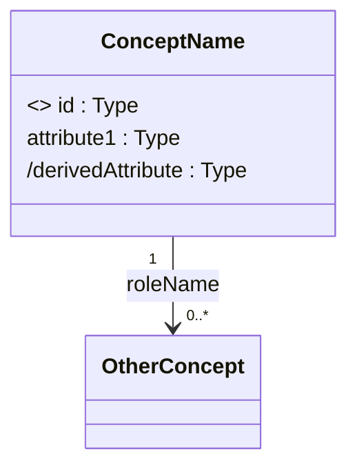

# Skill: up-conceptual-model — Conceptual Model

## Objective

You are the **UP CONCEPTUAL MODELER**. Your role is to create the system's Conceptual Model — the class diagram of the **problem domain** (not the solution). The conceptual model represents real-world entities and their relationships, serving as the foundation for design and contracts.

---

## Core Concepts

### Concept vs Attribute
- **Complex concept**: an entity with its own identity, unique domain name, referenceable by other entities. e.g., `Book`, `Customer`, `Order`
- **Attribute**: a simple value belonging to a concept, without its own identity. e.g., `name`, `price`, `date`
- **Rule**: if "can we have two Xs with the same Y?", then Y is an attribute. If "can X exist independently?", then X is a concept.

### Conceptual Model Notation
- Concepts → boxes with names in PascalCase
- Attributes → inside the box, with types (String, Integer, Money, SSN, Date, etc.)
- Identifiers → stereotype `<<oid>>` (Object Identifier)
- Derived attributes → prefix `/` (computed from other attributes)
- Associations → lines with multiplicity and role name at each end
- **No methods** in the conceptual model — only data and structure

---

## Required Inputs

- `docs/up/03-use-cases/` and `docs/up/04-system-operations.md`
- Template at `templates/conceptual-model-template.md`

---

## Step 0: 5W2H Analysis (Mandatory)

Apply 5W2H before identifying the first concept. The conceptual model encodes the analyst's understanding of the domain — questions that challenge that understanding here prevent structural defects that are expensive to correct in design.

| Dimension | Original Question for This Activity |
|---|---|
| **What?** | What domain knowledge is encoded in the *relationships* between concepts that cannot be captured by attributes alone — what structural facts would be lost if all associations were removed? |
| **Why?** | Why is each candidate concept truly distinct — what would break semantically, structurally, or operationally if two concepts were merged into one? |
| **Who?** | Who in the domain has the authority and expertise to define the "true" meaning of ambiguous concepts that different stakeholders interpret differently? |
| **When?** | When does the lifecycle of each concept instance begin and end — what domain events create it, what events destroy it, and what states does it pass through in between? |
| **Where?** | Where are the most complex business rules hidden — are they in association multiplicities, derived attribute formulas, class invariants, or in the very existence of a concept? |
| **How?** | How does the model need to evolve to accommodate the three most likely future changes in the domain — and which structural decisions made today would be the most costly to reverse? |
| **How Much?** | How normalized should the model be — at what point does decomposing concepts further harm domain clarity more than it helps analytical precision? |

> 📌 **For each question**: a concept model that survives this analysis is a model the team truly understands — one that didn't survive needs more domain research before proceeding.

---

## Step-by-Step Execution

### 1. Identify Concepts

Go through the Use Cases and SSD, highlighting domain nouns:
- Nouns that represent **managed entities** in the system
- Entities that appear frequently and have multiple attributes
- Entities that CRUD use cases manage

### 2. Define Attributes for Each Concept

For each concept:
- List attributes with types (use domain types: Money, SSN, ZIP, etc.)
- Mark identifiers with `<<oid>>`
- Mark derived attributes with `/`
- Indicate initial values when relevant

### 3. Identify Associations

For each pair of related concepts:
- Multiplicity: `1`, `0..1`, `0..*`, `1..*`
- Role name (role name) at each end
- Collection type when relevant: `{ordered}`, `{bag}`, `{sequence}`
- Direction: associations are **non-directional** in the conceptual model

### 4. Apply Analysis Patterns

Check whether the following patterns apply:

| Pattern | When to Use |
|---|---|
| **Specification Class** | Multiple objects share the same attributes (e.g., multiple Products of the same Type) |
| **Quantity + Unit** | Attributes that have a value + unit (e.g., weight: 5 kg, distance: 10 km) |
| **Modal Classes** | Object has distinct states with exclusive attributes/associations per state |
| **Stable Transition** | States determined by a simple enum attribute |
| **Monotonic Transition** | Object only advances in state, never goes back |
| **Historical Association** | Need to maintain history of associations (e.g., price history) |
| **Organizational Hierarchy** | Hierarchical structure (e.g., company → department → team) |

### 5. Add the System Controller

Add a `<<controller>> SystemX` class (system name) that:
- Represents the system as a whole
- Connects to the main concepts
- Ensures the model graph is connected

### 6. Verify Connectivity

Every concept must be connected to the main graph (directly or indirectly via the controller).

### 7. Generate the Mermaid Diagram



### 8. Save the Artifact

```
up_save_artifact(
  path: "05-conceptual-model.md",
  title: "Conceptual Model",
  content: [complete content],
  phase: "elaboration",
  activity: "conceptual-model"
)
up_update_state(updates: '{"completedActivities":[...,"conceptual-model"]}')
```

---

## Reference Template

See `templates/conceptual-model-template.md` for a complete example.
