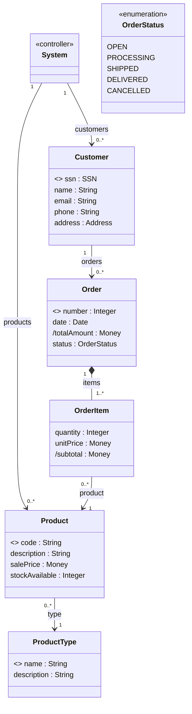

# Conceptual Model: [System Name]

> **Version:** 1.0 | **Phase:** Elaboration

---

## Conceptual Class Diagram

---

## Concept Descriptions

### Customer
A person or organization that places orders in the system.
- `ssn`: unique customer identifier (`<<oid>>`)
- `totalAmount`: sum of item subtotals (derived `/`)

### Order
Record of a purchase made by a customer.
- `number`: unique sequential identifier (`<<oid>>`)
- `status`: current order state (`OrderStatus` enumeration)
- `totalAmount`: sum of item subtotals (derived `/`)

### OrderItem
**Association class** between Order and Product — represents each line of the order.
- `subtotal`: `quantity * unitPrice` (derived `/`)

### Product
Item available for sale in the catalog.
- `code`: unique product identifier (`<<oid>>`)

### ProductType
**Specification Class pattern** — groups products of the same type (e.g., Book, Electronics).
Avoids repeating common attributes across multiple Products.

---

## Associations

| From | To | Multiplicity | Role | Note |
|---|---|---|---|---|
| System | Customer | 1 → 0..* | customers | Controller connects to the model |
| Customer | Order | 1 → 0..* | orders | A customer has zero or more orders |
| Order | OrderItem | 1 → 1..* | items | Composition — items belong to the order |
| OrderItem | Product | 0..* → 1 | product | Many items reference the same product |
| Product | ProductType | 0..* → 1 | type | Specification — multiple products of the same type |

---

## Applied Patterns

| Pattern | Where Applied | Justification |
|---|---|---|
| Specification Class | ProductType ← Product | Avoids repeating description and category in each product |
| Association Class | OrderItem | Association between Order and Product with its own attributes |
