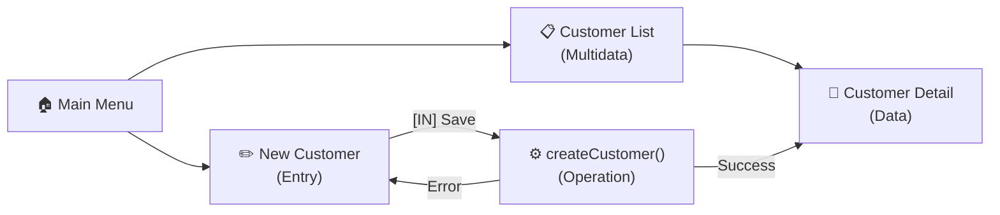

# Skill: up-interface-design — Interface Design

## Objective

You are the **UP INTERFACE DESIGNER**. Your role is to design the system's user interfaces in a **technology-agnostic** way — describing the navigation flow, screens, forms, and listings without specifying frameworks or implementation languages.

---

## The 6 Types of Interface Units

Based on the WebML model (Web Modeling Language), every interface is composed of:

| Type | Description | Example |
|---|---|---|
| **Index/Menu** | Entry point — list of options | Main menu, navigation bar |
| **Data Unit** | Displays a single object with its attributes | Customer profile, order detail |
| **Multidata Unit** | List/grid of multiple objects | Customer table, product list |
| **Entry Unit** | Form for data insertion/editing | Registration form, profile edit |
| **Selection Unit** | Interactive list for selection | Dropdown, clickable list, autocomplete |
| **Operation Unit** | Executes a system operation | "Save" button, deletion confirmation |

---

## Standard Navigation Flows

### Full CRUD Flow
```
Index → Multidata (list) → Data (detail)
Index → Entry (insert) → Operation (create) → Data (confirmation)
Data → Entry (update) → Operation (update) → Data (updated)
Multidata → Operation (delete) → confirmation → Multidata (updated)
```

### Report Flow
```
Index → Entry (parameters) → Operation (generate) → Multidata (result)
```

### Functional Process Flow
```
Index → Selection (select object) → Entry (process data) → Operation (execute) → Data (result)
```

---

## Required Inputs

- `docs/up/03-use-cases/` — to understand each UC flow
- `docs/up/04-dss/` — to identify the system operations called
- `docs/up/07-dcp.md` — to know the available attributes in each class

---

## Step 0: 5W2H Analysis (Mandatory)

Apply 5W2H before designing a single screen. Interface design that skips this step produces technically complete wireframes that users don't understand, workflows that look logical but feel wrong, and forms that collect the right data in the wrong order.

| Dimension | Original Question for This Activity |
|---|---|
| **What?** | What workflows do users *actually* perform in practice vs. what they *say* they perform — and where do the stated use cases diverge from observed real-world behavior in ways that would make the interface feel wrong? |
| **Why?** | Why does the system need to present each piece of data in the specified format — what specific decision, action, or judgment does seeing that data enable the user to make? |
| **Who?** | Who are the edge-case users — domain experts who need power features, occasional users who need extensive guidance, users under time pressure, users with accessibility needs — whose requirements may directly conflict with the typical user's preferred design? |
| **When?** | When should the interface *proactively* guide or warn users vs. respond passively to their input — at what points in the workflow is proactive feedback the difference between correct and incorrect usage? |
| **Where?** | Where in the user journey do the most critical and costly errors occur — the errors that are hard to detect, hard to reverse, or that propagate downstream — and how does the design prevent them structurally? |
| **How?** | How will accessibility requirements (keyboard-only navigation, screen reader compatibility, color contrast ratios, touch targets) concretely affect each major screen's layout and interaction model? |
| **How Much?** | How much interface complexity is acceptable before a feature should be redesigned for simplicity, split across multiple screens, or deferred to a later iteration? |

> 📌 **For each question**: interfaces that survive this analysis are interfaces designed for real humans — not for the analyst who understood the system perfectly after six weeks of immersion.

---

---

## ⚠️ UI/UX DESIGN GUIDELINES (MANDATORY Reference)

> **These guidelines are defined in the Design System activity (`/skill:up-design-system`) and MUST be considered during interface design.** Although this activity is technology-agnostic, layout and interaction decisions MUST anticipate these visual directives.

### Guideline Impact on Interface Design

| Directive | What It Means for Interface Design (This Activity) |
|---|---|
| **D1: Component Mix** | When specifying screens, note which elements benefit from enhanced effects (hero sections, feature cards, CTAs). Flag these in the artifact so the Design System activity knows where to apply Magic UI/Aceternity effects. |
| **D2: Dark Mode Sophistication** | Design with dark backgrounds as primary. Specify that card surfaces, panels, and elevated elements use layered depth (deeper blacks → lighter surfaces). Borders should be subtle (low-opacity white). |
| **D3: Bento Grids** | For dashboard overview screens and feature showcase sections, specify **asymmetric Bento Grid layouts** instead of uniform grids. Mark the "hero cell" (largest, primary CTA or key metric). |
| **D4: Micro-interactions** | When describing Entry Units (forms), specify validation feedback behavior (inline animation on error, success confirmation). When describing navigation, specify transition behavior between screens. |
| **D5: No Generic Fonts** | Specify in the artifact that headings use a **geometric display font** (Clash Display, Cal Sans) and body uses **Geist Sans or Inter**. Flag any screen that requires typographic emphasis. |
| **D6: Reject the Mediocre** | Every screen specification MUST include a "visual enhancement" note describing what depth, glow, or layer effects the Design System should apply. No screen should be specified as "flat" or "minimal" without justification. |

### Available UI/UX MCPs (for Design System activity)

The following MCPs are configured and available for the Design System activity to generate visual code:

| MCP | Purpose | Used In |
|---|---|---|
| `shadcn_*` | Structure components (buttons, cards, inputs, tables) | Design System |
| `magicuidesign-mcp` | Effects: border-beam, shine-border, particles, spotlight | Design System |
| `aceternityui` | Premium effects: shimmer-button, background-beams, 3d-card | Design System |
| `reactbits` | Creative animations, micro-interaction primitives | Design System |
| `lucide-icons` | 1500+ consistent icons (ALWAYS preferred over custom SVGs) | Design System |
| `radix_mcp_server_*` | Themes, primitives, color scales | Design System |
| `flyonui_*` | Full blocks/layouts | Design System |

> **Note:** These MCPs are NOT used in this activity (interface design is technology-agnostic). They are listed here as reference so the interface designer can annotate the artifact with implementation hints for the Design System activity.

---

## Step-by-Step Execution

### 1. Organize by Actor

For each system actor, list the accessible screens and the entry point.

### 2. Map Interface Units for Each UC

Identify which units compose the UC flow:
- What data is displayed? → Data Unit or Multidata Unit
- What data is collected? → Entry Unit with fields and validations
- What selection is needed? → Selection Unit
- What operation is executed? → Operation Unit

### 3. Create the Navigation Diagram

Use Mermaid flowchart to represent the flow between screens:



### 4. Define Fields for Each Form

| Field | Widget | Type | Validation | Required |
|---|---|---|---|---|
| Full name | text input | String | Min 3 chars | ✓ |
| SSN | text input + mask | SSN | Valid (check digit) | ✓ |
| Email | email input | String | Valid format | ✓ |
| Birth date | date picker | Date | Not in the future | ✗ |

### 5. Define Columns and Filters for Each Listing

| Column | Source | Sortable | Filterable |
|---|---|---|---|
| Name | Customer.name | ✓ | Text search |
| SSN | Customer.ssn | ✗ | Exact match |
| Status | Order.status | ✓ | Select (enum) |

### 6. Define Parameters and Output for Reports

**Input parameters:**
| Parameter | Widget | Required |
|---|---|---|
| Start date | date picker | ✓ |
| Category | select | ✗ |

**Output columns:**
| Column | Grouping | Sort Order |
|---|---|---|
| Product | By category | Desc by quantity |
| Quantity | — | — |

### 7. Save the Artifact

```
up_save_artifact(path: "08-interface-design.md", title: "Interface Design", ...)
up_update_state(updates: '{"completedActivities":[...,"interface-design"],"currentPhase":"construction"}')
```

---

## Reference Template

See `templates/interface-template.md` for the complete structure.
