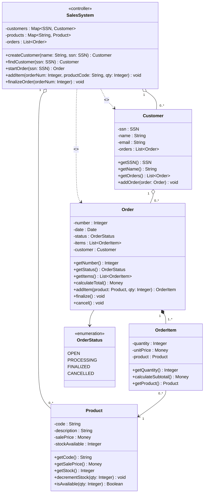

# DCD — Design Class Diagram: [System Name]

> **Version:** 1.0 | **Phase:** Construction

---

## Design Class Diagram (DCD)

---

## Responsibilities per Class

### SalesSystem (Facade Controller)
- **GRASP**: Controller (facade), Creator (creates Customer and Order)
- **DOING responsibilities**: coordinate system operations, create main objects
- **KNOWING responsibilities**: look up customers and products by identifier

### Customer
- **GRASP**: Information Expert (knows its orders)
- **KNOWING responsibilities**: own data, own orders

### Order
- **GRASP**: Creator (creates OrderItem), Information Expert (calculates total)
- **DOING responsibilities**: add item, finalize, cancel
- **KNOWING responsibilities**: its items, calculate total (delegates to items)

### OrderItem
- **GRASP**: Information Expert (calculates subtotal)
- **KNOWING responsibilities**: subtotal = quantity × unitPrice
