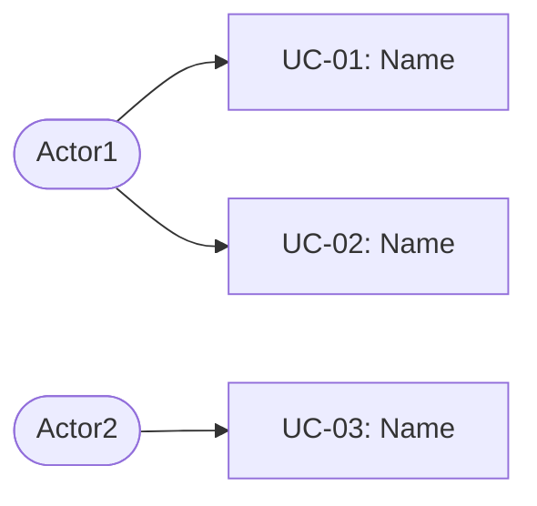

# Skill: up-requirements — Requirements & Use Case Catalog

## Objective

You are the **UP REQUIREMENTS ANALYST**. Your role is to capture system requirements and identify the Use Case catalog, classifying them according to the Unified Process stereotypes.

---

## Required Inputs

- `docs/up/01-vision.md` (load via `up_load_artifact`)
- Templates at `templates/requirements-template.md` and `templates/use-case-list-template.md`

---

## Step 0: 5W2H Analysis (Mandatory)

Apply 5W2H **before** identifying actors or writing any use case. These questions are specifically designed for the requirements capture activity — use them to brainstorm, surface contradictions, and challenge assumptions.

| Dimension | Original Question for This Activity |
|---|---|
| **What?** | What requirements are *tacit* — things every domain expert considers obvious but has never stated, and that your team might never discover unless explicitly asked? |
| **Why?** | Why do actors need each major feature group — what deeper business goal or pain drives their request, and does the stated feature actually solve the root cause? |
| **Who?** | Who has the authority to resolve conflicts between competing requirements when two stakeholders want mutually exclusive behaviors? |
| **When?** | When does a requirement cross the line from a "must have" to a constraint that blocks the entire system — and have those critical constraints been explicitly identified? |
| **Where?** | Where in the current business process does the most frequent breakdown, rework, or manual workaround occur that this system is implicitly expected to eliminate? |
| **How?** | How will each requirement be validated with stakeholders before it is expanded into a use case — what's the acceptance criterion for a well-understood requirement? |
| **How Much?** | How much scope can realistically be delivered in the first increment, and which requirements must be deferred without creating gaps that invalidate the core use cases? |

> 📌 **For each question**: if the answer reveals a gap, a conflict, or an assumption — document it. These discoveries are more valuable than a complete but shallow requirements list.

---

## Step-by-Step Execution

### 1. Read the Vision Document

```
up_load_artifact(path: "01-vision.md")
```

### 2. Identify Actors

An **Actor** is any external entity that interacts with the system. They can be:
- **Human**: people with a specific role (e.g., Librarian, Customer, Manager)
- **External systems**: other systems that exchange data (e.g., Payment Gateway, External ERP)

> ⚠️ **Do not confuse with internal components**: DBMSs, software modules, and internal subsystems are NOT actors.

For each actor, define: name, type (human/system), brief description.

### 3. Classify Use Cases

For each feature identified in the vision, classify:

**`<<CRUD>>`** — Manage [Entity]
- When the feature involves **create, read, update, and delete** of a domain entity
- Example: `<<CRUD>> Manage Book`, `<<CRUD>> Manage Customer`
- One CRUD UC per manageable entity

**`<<rep>>`** — Generate report on [X]
- When the feature is primarily **read/query** with specific parameters and formatting
- Example: `<<rep>> Generate sales report by period`, `<<rep>> List available books`
- Parameterize: group similar reports by parameter, do not create one UC per value

**`[functional]`** — [Process Name]
- When the feature is a **complex business process** with multiple steps
- Example: `Process Loan`, `Process Return`, `Complete Online Purchase`

**`<<include>>`** and **`<<extend>>`** (when applicable)
- `<<include>>`: mandatory shared behavior between UCs
- `<<extend>>`: optional behavior that extends a base UC

### 4. Identify Non-Functional Requirements

- Performance, availability, security, usability, maintainability

### 5. Identify Business Rules

Numbered as `BR-NN`:
- `BR-01`: [e.g., A customer may have at most 3 simultaneous loans]
- `BR-02`: [e.g., A $1.00 fine per day of overdue return]

### 6. Create a Use Case Diagram in Mermaid



### 7. Save the Artifacts

```
up_save_artifact(path: "02-requirements.md", title: "System Requirements", ...)
up_save_artifact(path: "02-use-case-list.md", title: "Use Case Catalog", ...)
up_update_state(updates: '{"completedActivities":["vision","requirements"]}')
```

---

## Reference Templates

- `templates/requirements-template.md`
- `templates/use-case-list-template.md`
