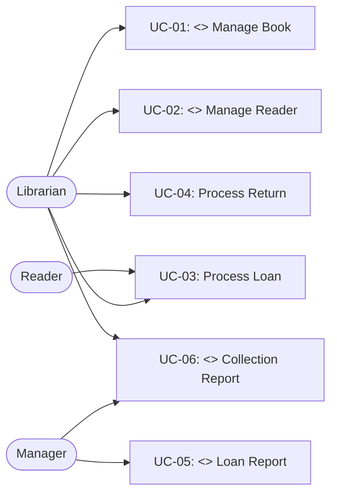

# Use Case Catalog: [System Name]

> **Version:** 1.0 | **Date:** [date]

---

## Actors

| Actor | Type | Description |
|---|---|---|
| [e.g., Librarian] | Human | [e.g., Responsible for managing the collection and loans] |
| [e.g., Reader] | Human | [e.g., User who borrows books and makes reservations] |
| [e.g., Payment Gateway] | System | [e.g., External system for processing fine payments] |

---

## Use Cases

| ID | Stereotype | Name | Actors | Description |
|---|---|---|---|---|
| UC-01 | `<<CRUD>>` | Manage Book | Librarian | Create, read, update, and delete books in the collection |
| UC-02 | `<<CRUD>>` | Manage Reader | Librarian | Register and maintain reader profiles |
| UC-03 | `[functional]` | Process Loan | Librarian, Reader | Loan process for a copy to a reader |
| UC-04 | `[functional]` | Process Return | Librarian | Register a return and calculate fines |
| UC-05 | `<<rep>>` | Generate loan report | Manager | List of loans by period with status |
| UC-06 | `<<rep>>` | Generate collection report | Manager, Librarian | Collection inventory with availability |

---

## Use Case Diagram

---

## Summary

| Stereotype | Count |
|---|---|
| `<<CRUD>>` | N |
| `<<rep>>` | N |
| `[functional]` | N |
| **Total** | **N** |
